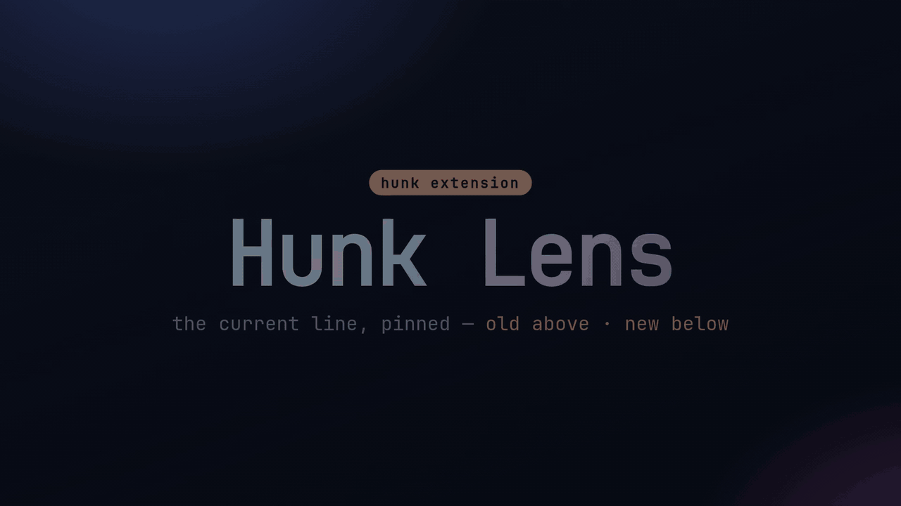

# Hunk Lens

Keep the selected split-diff row visible at the bottom of [Hunk](https://hunk.dev), with the old version above the new version.

[](https://github.com/modem-dev/hunk-lens/actions/workflows/ci.yml)
[](LICENSE)



<sub>Prefer a still? See the [screenshot](assets/hunk-lens.png).</sub>

## Install

Hunk 0.19 or newer can install the extension directly from GitHub:

```bash
hunk extension install modem-dev/hunk-lens
```

New Hunk sessions load it automatically.

## Use

Open a split review as usual:

```bash
hunk diff --mode split
```

The lens occupies three rows at the bottom of the review and follows Hunk's current-line marker. Use **Extensions → Toggle current-line lens** to hide or restore it.

The lens stays out of the layout when current-line paint is unavailable, including stacked layout, a disabled current-line marker, and alternate file presentations.

## Manage

```bash
hunk extension update hunk-lens
hunk extension remove hunk-lens
```

Pin a release when you want updates to stay on a specific version:

```bash
hunk extension install modem-dev/hunk-lens@v0.1.0
```

## Develop

Hunk serves React, OpenTUI, and `hunkdiff/extension` at runtime. This repository keeps them as development-only dependencies and ships TypeScript source directly—there is no build step.

```bash
bun install
bun run check
hunk diff --mode split --extension /path/to/hunk-lens
```

See [Hunk's extension guide](https://github.com/modem-dev/hunk/blob/main/docs/extensions.md) for the public API and trust model.

## Contributing

See [CONTRIBUTING.md](CONTRIBUTING.md). Report vulnerabilities through [GitHub's private security advisory flow](SECURITY.md).

## License

[MIT](LICENSE)
